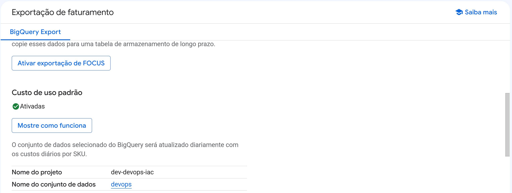
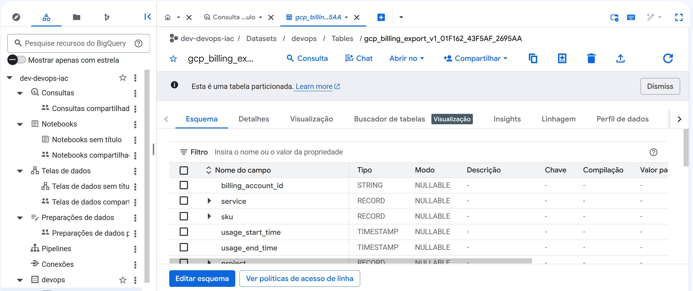

# Exportação de Faturamento do Google Cloud para BigQuery

## Visão Geral

Este documento descreve o processo de exportação dos dados de faturamento do Google Cloud Platform (GCP) para o BigQuery, permitindo análises avançadas de custos, consultas personalizadas e criação de dashboards para acompanhamento financeiro.

---

## 01 - Configuração da Exportação no Google Cloud

### Configuração Realizada

| Parâmetro | Valor |
|-----------|-------|
| **Tipo de Exportação** | BigQuery Export (Exportação de Faturamento) |
| **Status** | Ativada / Copiar para tabela de armazenamento de longo prazo |
| **FOCUS Export** | Ativado (Exportação de FOCUS - FinOps Open Cost and Specification) |
| **Custo de Uso Padrão** | Ativado |
| **Frequência de Atualização** | Diária (custos diários por SKU) |
| **Projeto de Destino** | `dev-devops-iac` |
| **Dataset de Destino** | `devops` |

### Descrição do Processo

1. Os dados de faturamento são exportados automaticamente do Cloud Billing
2. O conjunto de dados selecionado no BigQuery é atualizado diariamente
3. Os custos são organizados por SKU (Stock Keeping Unit)
4. Os dados ficam disponíveis para consultas e análises

---

## 02 - Estrutura da Tabela no BigQuery

